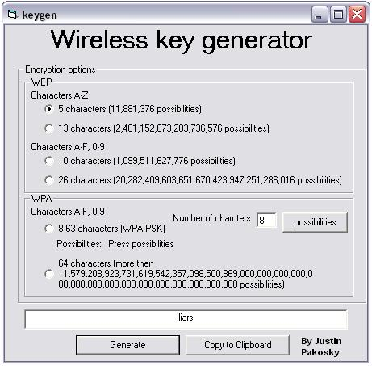



## WEP/WPA Keygen

### Description

I made this program to help me create wireless WEP(four diffrent ways),WPA and WPA-PSK keys (so i dont just have to hit keys). i added possabilitys to show how many keys there can be to clients. Enjoy ~Justin Pakosky
 
### More Info
 

             |
---                |---
**Submitted On**   |2005-07-20 02:01:54
**By**             |[Justin Pakosky](https://github.com/Planet-Source-Code/PSCIndex/blob/master/ByAuthor/justin-pakosky.md)
**Level**          |Beginner
**User Rating**    |4.0 (8 globes from 2 users)
**Compatibility**  |VB 6\.0
**Category**       |[Encryption](https://github.com/Planet-Source-Code/PSCIndex/blob/master/ByCategory/encryption__1-48.md)
**World**          |[Visual Basic](https://github.com/Planet-Source-Code/PSCIndex/blob/master/ByWorld/visual-basic.md)
**Archive File**   |[WEP\_WPA\_Ke1915307202005\.zip](https://github.com/Planet-Source-Code/justin-pakosky-wep-wpa-keygen__1-61793/archive/master.zip)

